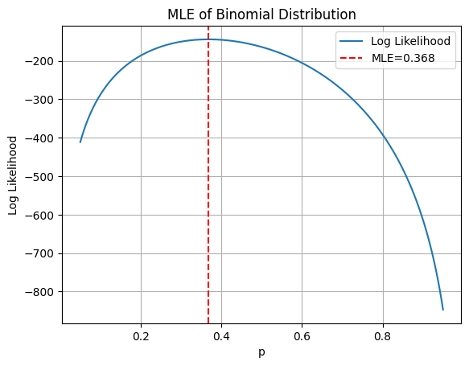

# Experiment 1: Maximum Likelihood Estimation (MLE) of Binomial Distribution

## Aim

To estimate the probability parameter **p** of a Binomial distribution using the **Maximum Likelihood Estimation (MLE)** method on the Breast Cancer Wisconsin dataset.

---

## Introduction

Maximum Likelihood Estimation (MLE) is a statistical method used to estimate the unknown parameters of a probability distribution by finding the values that make the observed data most likely.

In this experiment:

- **Malignant (0)** is considered a **success**.
- **Benign (1)** is considered a **failure**.
- The dataset is divided into **non-overlapping batches of 10 patients**.
- Each batch forms one **Binomial observation** by counting the number of malignant cases.
- The probability parameter **p** is estimated using:
  - Grid Search on the log-likelihood function.
  - Analytical Maximum Likelihood Estimation (MLE).

The log-likelihood curve is then plotted to identify the value of **p** that maximizes the likelihood.

---

## Theory

### Maximum Likelihood Estimation (MLE)

Maximum Likelihood Estimation is a parameter estimation technique that selects the parameter values that maximize the probability (likelihood) of observing the given data.

### Binomial Distribution

The Binomial distribution models the number of successes in a fixed number of independent trials.

**Probability Mass Function (PMF):**

\[
P(X=x)=\binom{n}{x}p^x(1-p)^{n-x}
\]

where:

- **n** = Number of trials
- **x** = Number of successes
- **p** = Probability of success

### Analytical MLE

For a Binomial distribution,

\[
\hat{p}=\frac{\sum x_i}{mn}
\]

where:

- \(x_i\) = Number of successes in batch *i*
- **m** = Number of batches
- **n** = Number of trials per batch

---

## Notebook

- `MLE_Binomial.ipynb`

---

## Output

---

## Conclusion

> Successfully estimated the Binomial distribution parameter **p** using the Maximum Likelihood Estimation (MLE) method.
>
> Converted the Breast Cancer Wisconsin dataset into Binomial observations by grouping every **10 patients** and counting malignant cases.
>
> Verified that the **grid search estimate** closely matched the **analytical MLE**, confirming the correctness of the implementation.
>
> Visualized the **log-likelihood function**, where the maximum point corresponds to the estimated value of **p**.
>
> Demonstrated the practical application of **MLE for parameter estimation**, an important concept in machine learning and statistical inference.

---

## Viva Questions

### 1. What is Maximum Likelihood Estimation (MLE)?

MLE is a statistical method used to estimate unknown parameters by maximizing the likelihood of observing the given data.

### 2. Why is the Binomial distribution used in this experiment?

Because each patient is classified as either **malignant (success)** or **benign (failure)**, making it a sequence of Bernoulli trials grouped into fixed-size batches.

### 3. Why are patients grouped into batches of 10?

A Binomial distribution requires a fixed number of independent trials (**n = 10**), so each batch represents one Binomial experiment.

### 4. Why is the log-likelihood used instead of the likelihood?

The likelihood is the product of many small probabilities, which can become numerically unstable. Taking the logarithm converts the product into a sum, making computations more stable.

### 5. What is the analytical MLE for the Binomial parameter?

\[
\hat{p}=\frac{\text{Total Successes}}{\text{Total Trials}}
\]

### 6. Why do the grid search and analytical estimates give similar results?

Because both methods estimate the same parameter. Grid search approximates the optimum, while the analytical formula gives the exact solution.

### 7. What does the peak of the log-likelihood curve represent?

It represents the value of **p** that best explains the observed data and is therefore the Maximum Likelihood Estimate.

### 8. Name some applications of MLE.

- Machine Learning
- Logistic Regression
- Naive Bayes
- Hidden Markov Models
- Gaussian Mixture Models
- Parameter estimation in statistical inference

---

## References

- Scikit-learn Breast Cancer Wisconsin Dataset
- NumPy Documentation
- Matplotlib Documentation
- Bishop, *Pattern Recognition and Machine Learning*
- Murphy, *Machine Learning: A Probabilistic Perspective*