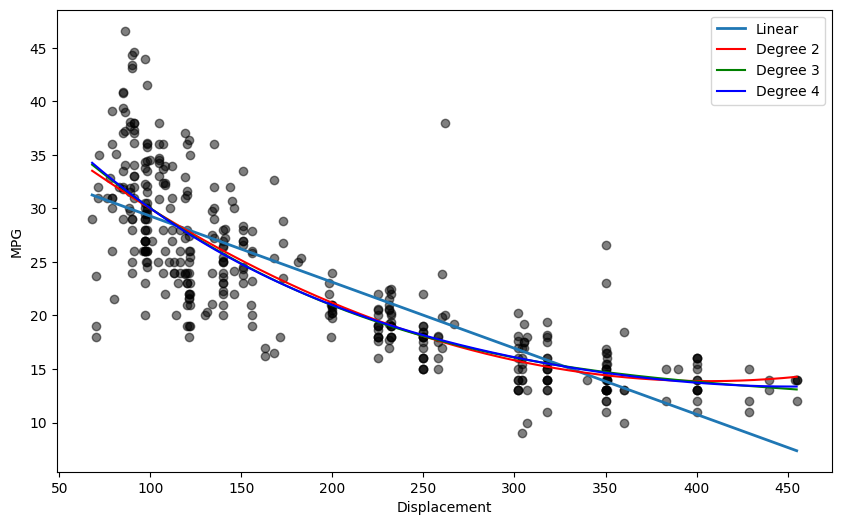

# Polynomial Regression on the Auto MPG Dataset

Predicting **Miles Per Gallon (MPG)** from **Engine Displacement** using Polynomial Regression and comparing its performance with Linear Regression.

---

## Overview

Real-world data is not always linear.

In this experiment, we explore how Polynomial Regression models non-linear relationships by extending Linear Regression with polynomial features. The performance of different polynomial degrees is evaluated and compared against a simple linear regression model.

This experiment demonstrates how feature engineering can improve model performance without changing the underlying learning algorithm.

---

## Problem Statement

Implement Polynomial Regression on the Auto MPG dataset to predict **Miles Per Gallon (MPG)** based on **Engine Displacement**.

### Objectives

- Load and preprocess the Auto MPG dataset
- Train a Linear Regression model
- Train Polynomial Regression models with different degrees
- Compare model performance using MSE and R² Score
- Visualize the fitted regression curves
- Analyze the effect of increasing polynomial degree

---

## Dataset

**Dataset:** Auto MPG

**Feature**

- Engine Displacement

**Target**

- Miles Per Gallon (MPG)

---

## Workflow

```text
Dataset
   │
   ▼
Preprocessing
   │
   ▼
Train/Test Split
   │
   ├──────────────► Linear Regression
   │
   └──────────────► Polynomial Features
                        │
                        ▼
                Linear Regression
                        │
                        ▼
                 Model Evaluation
                        │
                        ▼
                  Performance Comparison
                        │
                        ▼
                  Regression Visualization
```

---

## Concepts Covered

- Supervised Learning
- Regression
- Linear Regression
- Polynomial Regression
- Feature Engineering
- Model Evaluation
- Mean Squared Error (MSE)
- R² Score
- Underfitting vs Overfitting

---

## Technologies Used

- Python
- NumPy
- Pandas
- Matplotlib
- Scikit-learn
- Jupyter Notebook

---

## Results

The notebook compares:

- Linear Regression
- Polynomial Regression (Degree 2)
- Polynomial Regression (Degree 3)
- Polynomial Regression (Degree 4)

using

- Mean Squared Error (MSE)
- R² Score

along with a visualization of the fitted regression curves.
## Output

<p align="center">
  
</p>
---

## Key Learning

- Linear Regression assumes a straight-line relationship.
- Polynomial Regression captures non-linear patterns by creating higher-order features.
- Higher polynomial degrees can improve accuracy but may also lead to overfitting.
- Polynomial Regression is still a Linear Regression model applied to transformed features.

---

## Repository Contents

```text
02-auto-mpg-poly-regression/
├── Polynomial_Regression.ipynb
├── README.md
└── regression_plot.png

```

---

## References

- Scikit-learn Documentation
- Auto MPG Dataset (UCI Machine Learning Repository)