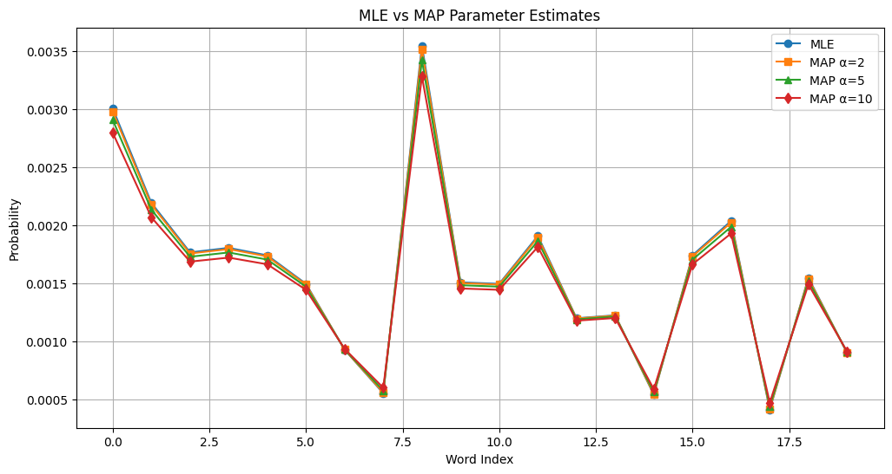

# Experiment 05: Multinomial Distribution Parameter Estimation using MLE and MAP

Estimate the parameters of a multinomial distribution using **Maximum Likelihood Estimation (MLE)** and **Maximum A Posteriori (MAP)** on the **20 Newsgroups** dataset. Compare the effect of different **Dirichlet priors** on the estimated probabilities.

---

## Aim

To estimate the parameters of a multinomial distribution using MLE and MAP, and analyze the impact of different Dirichlet priors on parameter estimation.

---

## Objectives

- Load and preprocess the 20 Newsgroups dataset.
- Estimate multinomial parameters using Maximum Likelihood Estimation (MLE).
- Apply Maximum A Posteriori (MAP) estimation using different Dirichlet priors.
- Compare the probability estimates obtained from MLE and MAP.
- Study the effect of prior distributions on parameter estimation.

---

## Dataset

**20 Newsgroups Dataset**

The 20 Newsgroups dataset is a collection of approximately 20,000 text documents divided into 20 different categories. In this experiment, the documents are converted into **Bag-of-Words** representations using `CountVectorizer`, allowing each document to be modeled as a multinomial distribution of word counts.

---

## Theory

### Maximum Likelihood Estimation (MLE)

MLE estimates the parameters that maximize the likelihood of the observed data.

For a multinomial distribution,

\[
\theta_i=\frac{n_i}{\sum_j n_j}
\]

where:

- \(n_i\) = count of the *i-th* word
- \(\theta_i\) = estimated probability of the *i-th* word

---

### Maximum A Posteriori (MAP)

MAP extends MLE by incorporating prior knowledge through a probability distribution.

For a Dirichlet prior,

\[
\theta_i=
\frac{n_i+\alpha-1}
{\sum_j n_j+K(\alpha-1)}
\]

where:

- \(K\) = vocabulary size
- \(\alpha\) = Dirichlet prior parameter

---

## Workflow

1. Load the 20 Newsgroups dataset.
2. Preprocess the text using `CountVectorizer`.
3. Compute word frequencies.
4. Estimate multinomial probabilities using MLE.
5. Apply MAP estimation with different Dirichlet priors.
6. Compare the estimated probabilities.
7. Visualize the effect of different priors.
8. Analyze the results.

---

## Technologies Used

- Python 3
- NumPy
- Pandas
- Matplotlib
- Scikit-learn
- Jupyter Notebook

---

## Repository Structure

```text
05-multinomial-mle-map/
│
├── 05_multinomial_mle_map.ipynb
├── README.md
├── viva.md
└── multinomial-mle-map.png

```

---

## Results

- Successfully estimated multinomial parameters using both **MLE** and **MAP**.
- MLE relied only on the observed data.
- MAP incorporated a Dirichlet prior to produce smoother probability estimates.
- Larger values of the Dirichlet prior resulted in stronger smoothing and more uniform probability distributions.
- MAP reduced zero probabilities, making it more suitable for sparse text data.

---
## Output

<p align="center">
  
</p>
---

## Key Learning Outcomes

- Understood the difference between **MLE** and **MAP** estimation.
- Learned why the **Dirichlet distribution** is the conjugate prior of the multinomial distribution.
- Observed how prior knowledge influences parameter estimation.
- Understood the importance of smoothing in Natural Language Processing tasks.

---

**Course:** PCCST503 – Machine Learning Lab
**Experiment:** 05 – Multinomial Distribution Parameter Estimation using MLE and MAP