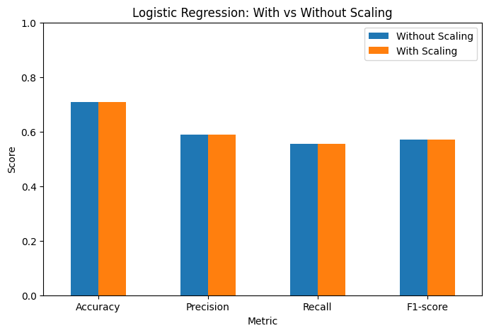
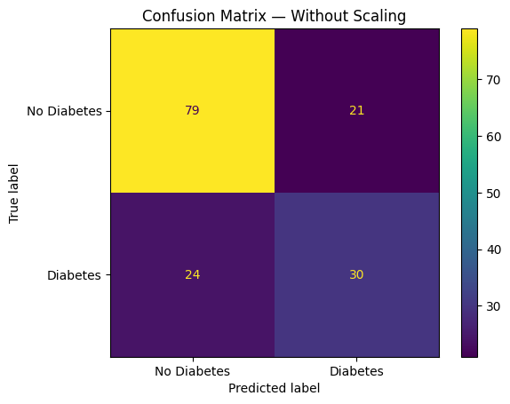

# Logistic Regression — Pima Indians Diabetes Dataset

## Aim

Implement a Logistic Regression model to predict diabetes using the Pima Indians Diabetes dataset and compare its performance with and without feature scaling.

## Dataset

The dataset contains medical measurements used to predict whether a patient has diabetes.

- `Outcome = 0` → No Diabetes
- `Outcome = 1` → Diabetes

## Implementation

1. Load the `diabetes.csv` dataset.
2. Separate features and target variable.
3. Split the data into training and testing sets.
4. Train Logistic Regression without feature scaling.
5. Evaluate the model.
6. Apply `StandardScaler` to the features.
7. Train Logistic Regression with feature scaling.
8. Compare both models using Accuracy, Precision, Recall and F1-score.
9. Visualize the results using a performance graph and confusion matrices.

## Evaluation Metrics

- **Accuracy** — Overall percentage of correct predictions.
- **Precision** — How many predicted diabetes cases were actually diabetes cases.
- **Recall** — How many actual diabetes cases were correctly identified.
- **F1-score** — Harmonic mean of Precision and Recall.

## Performance Comparison

## Confusion Matrix — Without Scaling

## Confusion Matrix — With Scaling

## Result

For this train-test split, Logistic Regression produced the same predictions with and without feature scaling.

The confusion matrix for both models was:

| | Predicted No Diabetes | Predicted Diabetes |
|---|---:|---:|
| **Actual No Diabetes** | 79 | 21 |
| **Actual Diabetes** | 24 | 30 |

Since the predictions were identical, the Accuracy, Precision, Recall and F1-score were also identical.

## Conclusion

Logistic Regression was successfully implemented for binary diabetes classification.

Feature scaling using `StandardScaler` did not change the final predictions or evaluation metrics for this particular experiment. However, scaling places features on a common scale and can help the optimization process of Logistic Regression.
