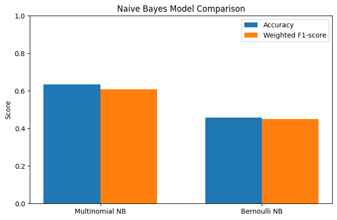
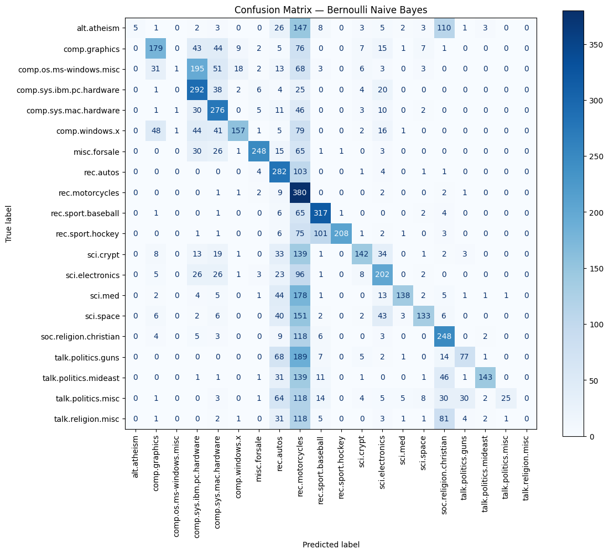

# Naive Bayes Text Classification — 20 Newsgroups

## Aim

Implement and compare **Multinomial Naive Bayes** and **Bernoulli Naive Bayes** for text classification using the **20 Newsgroups dataset**.

## Dataset

The 20 Newsgroups dataset contains text documents belonging to 20 different newsgroup topics.

Headers, footers, and quoted text are removed during loading to focus on the actual message content.

## Implementation

### 1. Data Preparation
- Load the training and testing data.
- Separate input text and target classes.
- Inspect sample documents and their corresponding classes.

### 2. Text Vectorization

`CountVectorizer` is used to convert text documents into numerical feature vectors.

- **Multinomial NB:** Uses word counts.
- **Bernoulli NB:** Uses binary word presence/absence.

### 3. Multinomial Naive Bayes

Multinomial Naive Bayes is trained using word-count features.

### 4. Bernoulli Naive Bayes

Bernoulli Naive Bayes is trained using binary features where each word is represented as either present (`1`) or absent (`0`).

## Evaluation

Both models are evaluated using:

- Accuracy
- Weighted F1-score
- Classification report
- Confusion matrix

## Results

The overall performance of both models is compared using Accuracy and Weighted F1-score.

## Confusion Matrices

### Multinomial Naive Bayes

The confusion matrix shows the actual classes against the classes predicted by the Multinomial Naive Bayes classifier.

### Bernoulli Naive Bayes

The confusion matrix shows the actual classes against the classes predicted by the Bernoulli Naive Bayes classifier.

## Multinomial vs Bernoulli Naive Bayes

| Feature | Multinomial NB | Bernoulli NB |
|---|---|---|
| Feature representation | Word counts | Word presence/absence |
| Repeated words | Matter | Do not matter |
| Main question | How many times does the word occur? | Is the word present? |

## Strengths

### Multinomial Naive Bayes
- Fast to train and predict.
- Works well with high-dimensional text data.
- Uses word-frequency information.
- Provides a strong baseline for text classification.

### Bernoulli Naive Bayes
- Simple and fast.
- Useful when word presence is more important than frequency.
- Works naturally with binary text features.

## Limitations

- Naive Bayes assumes conditional independence between features.
- Count-based models do not capture word order.
- The model has limited understanding of context and meaning.
- Performance depends on preprocessing and feature representation.

## Conclusion

Multinomial Naive Bayes and Bernoulli Naive Bayes provide simple and efficient approaches for text classification.

The main difference is the representation of text:

**Multinomial NB → word frequency**

**Bernoulli NB → word presence/absence**

The model with the higher Accuracy and Weighted F1-score performs better for this dataset.
